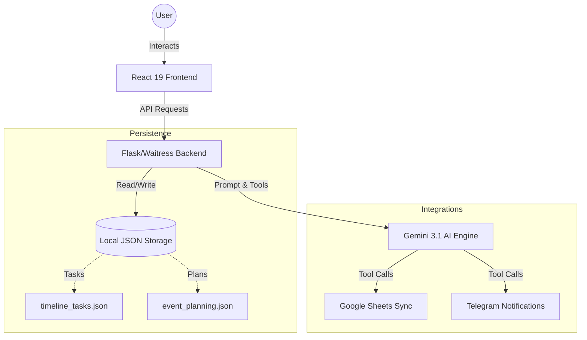

<div align="center">

</div>

# 🚀 Project DriveBot: Intelligence Hub

DriveBot is an AI-powered event management orchestration system designed to transform messy planning documents into structured, actionable intelligence. It leverages **Gemini 3.1 Reasoning** models to automate the heavy lifting of event coordination.

---

## 🏗 System Architecture

DriveBot operates as a unified platform where a production-ready Flask server orchestrates the interaction between the React frontend, the Gemini AI engine, and external productivity tools.



---

## ✨ Key Features

### 🔍 Multimodal Knowledge Extraction
Upload PDFs, spreadsheets, or even **video recordings of meetings**. DriveBot's AI analyzes the visual and audio content, summarizes the mission, and extracts critical action items directly from the footage.

### 📅 Dynamic Timeline Management
The system maintains a live database of tasks. The AI can automatically update status, adjust deadlines, and cross-reference tasks against the overall event objectives.

### 📊 Google Workspace Integration
- **Live Sync**: Export and overwrite your project timeline directly to a Google Sheet with a single command.
- **Calendar Visibility**: Quick links to open and manage your event in Google Calendar.

### ⚡ Telegram Orchestration
- **Agent Alerts**: Immediate notifications to committee groups for high-priority updates.
- **Event Broadcasts**: Automatically generate and share professional event summaries to your Telegram community.

### 🛡️ Robust Model Failback
Built-in resilience that automatically switches between `Gemini 3.1 Flash-Lite` and `Gemini 2.5` models to ensure continuous service even when hitting API quota limits.

---

## 🛠 Technology Stack

- **Frontend**: React 19, Vite, Tailwind CSS, Lucide Icons, Framer Motion.
- **Backend**: Python 3.12, Flask, Waitress.
- **Core AI**: Google GenAI SDK (0.6.0+), supporting Reasoning/Thinking signatures.
- **Integrations**: `gspread` (Google Sheets), `python-telegram-bot`.

---

## 🚀 Quick Start

### 1. Prerequisites
- **Node.js** (v18+)
- **Python** (v3.10+)
- **Google Cloud Service Account**: Place your `service_account.json` in the root directory.

### 2. Environment Setup
Create a `.env` file in the root based on `.env.example`:
```env
GEMINI_API_KEY=your_key_here
TELEGRAM_BOT_TOKEN=your_bot_token
TELEGRAM_ADMIN_CHAT_ID=your_chat_id
SPREADSHEET_ID=your_google_sheet_id
```

### 3. Run Locally
We provide a one-click hosting script:
```powershell
./host_system.ps1
```
This script will:
1. Install backend dependencies.
2. Build the optimized React frontend.
3. Start the production-ready server on [http://localhost:5000](http://localhost:5000).

---

## 📁 Project Structure

```text
├── backend/            # Flask API, AI Logic, and Tools
├── dist/               # Built Frontend (Generated)
├── local_storage/      # Local persistence for history/tasks
├── src/                # React Source Code
├── .env                # App Secrets
├── host_system.ps1     # Deployment Script
└── requirements.txt    # Python Dependencies
```

---
<div align="center">
Built for high-performance event teams. 🚀
</div>